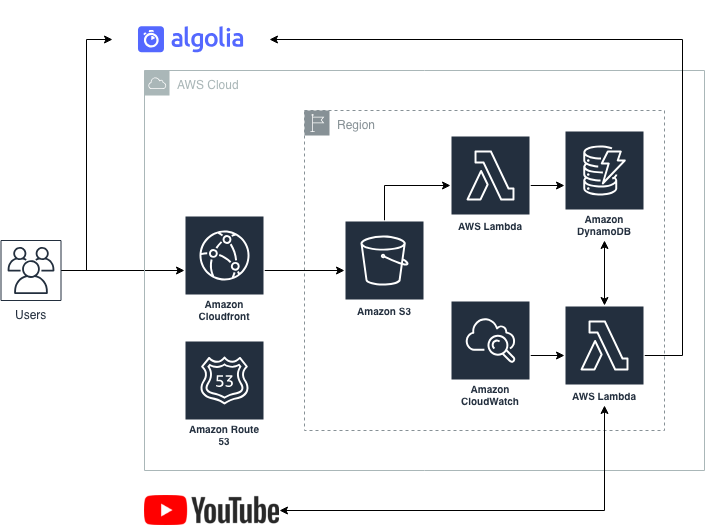

# Overview

Disappointed that I missed an opportunity to attend my first [AWS re:Invent](https://reinvent.awsevents.com/) conference (I had a ticket but changed jobs before I could go!), I decided to take to YouTube to catch up on all of the announcements and deep dive breakout sessions. When searching, I found myself overwhelemd and frustrated with irrelevent search results and outdated content. I just wanted a single spot to browse re:Invent specific videos, and have the ability to quickly and easily find what I was looking for.

The website [reinventvideos.com](https://reinventvideos.com) was built to solve exactly that problem.

Here's the infrastructure in a nutshell:

## Backend

The backend is powered by the [serverless framework](https://serverless.com). It builds a few components:

* A [Lambda](https://aws.amazon.com/lambda/) function that is triggered by an [Amazon CloudWatch](https://aws.amazon.com/cloudwatch/) event. When run, it queries the [YouTube API](https://developers.google.com/youtube/) to get latest statistics about re:Invent sessions. It combines that data with data stored in a DynamoDB table which holds information about the available podcasts for the sessions. When complete, it aggregates the data and updates Algolia search indexes.
* A second Lambda function that is triggered when a new file is put into the S3 /podcasts/ directory. This function will add a new item into [DynamoDB](https://aws.amazon.com/dynamodb/) with the session, year, and object key information. This data is used by the previous Lambda function and added to the Algolia indexes.

## Frontend

The frontend is powered by a single page app written in [Vue.js](https://vuejs.org/). It leverages the [Vue InstantSearch](https://community.algolia.com/vue-instantsearch/getting-started/getting-started.html) plugin to interface with Algolia. The UI is built with latest version of [Bootstrap](http://getbootstrap.com/).

Serving the application is [Amazon CloudFront](https://aws.amazon.com/cloudfront/) with [Amazon S3](https://aws.amazon.com/s3/) as the origin. DNS is hosted by [Amazon Route 53](https://aws.amazon.com/route53/).

## Future Enhancements

Time permitting, I'd like to extend functionality of the website to include:

* Allow users to create accounts and save / favorite videos for later viewing
* Provide powerpoint decks alongside the sessions
* Make certain parts of sessions discoverable, e.g. jump to Announcement X from a keynote